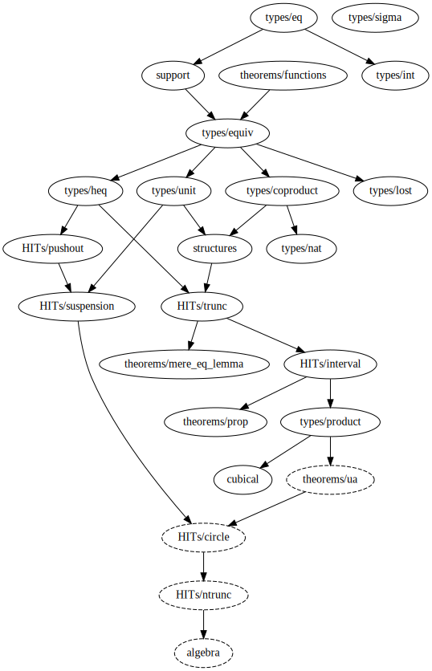

# Ground Zero

## HITs

[All HITs in library](https://github.com/groupoid/lean/tree/master/ground_zero/HITs) are constructed using [quotients](https://leanprover.github.io/theorem_proving_in_lean/axioms_and_computation.html#quotients). Quotients in Lean have good computational properties (`quot.ind` computes), so we can define HITs with them without any other changes in Lean’s kernel.

There’s many basic—not defined in terms of another Higher Inductive Types—HITs: truncations, pushout, homotopical reals.

Other HITs:

* Interval `𝕀` is defined as a propositionally truncated bool.
* Suspension `∑α` is defined as the pushout of the span **1** ← α → **1**.
* Circle `S¹` is the suspension of the `bool`.
* Sphere `S²` is the suspension of the circle.

## Cubical Type Theory ([cubical.lean](https://github.com/groupoid/lean/blob/master/ground_zero/cubical.lean))

In the topology functions from the interval to some type is a paths in this type. In HoTT book path type is defined as a classical inductive type with one constructor:

```lean
inductive eq {α : Sort u} (a : α) : α → Sort u
| refl : eq a
```

But if we define paths as `𝕀 → α`, then we can use a nice syntax for paths as in [cubicaltt](https://github.com/mortberg/cubicaltt) or [Arend](https://github.com/JetBrains/arend):

```lean
@[refl] def refl {α : Type u} (a : α) : a ⇝ a := <i> a

@[symm] def symm {α : Type u} {a b : α} (p : a ⇝ b) : b ⇝ a :=
<i> p # −i

def funext {α : Type u} {β : α → Type v} {f g : Π (x : α), β x}
  (p : Π (x : α), f x ⇝ g x) : f ⇝ g :=
<i> λ x, (p x) # i
```

The same in cubicaltt:

```cubicaltt
refl (A : U) (a : A) : Path A a a = <i> a

symm (A : U) (a b : A) (p : Path A a b) : Path A b a =
  <i> p @ -i

funExt (A : U) (B : A -> U) (f g : (x : A) -> B x)
       (p : (x : A) -> Path (B x) (f x) (g x)) :
       Path ((y : A) -> B y) f g = <i> \(a : A) -> (p a) @ i
```

We can freely transform cubical paths to classical and back:

```lean
def from_equality {α : Sort u} {a b : α} (p : a = b :> α) : path a b :=
path.lam (interval.rec a b p)

def to_equality {α : Sort u} {a b : α} (p : path a b) : a = b :> α :=
@cube.rec α 0 (begin intros B p, cases B with a b, exact a = b :> α end)
  (λ f, f # seg) (binary.leaf a b) p
```

## Dependency map

