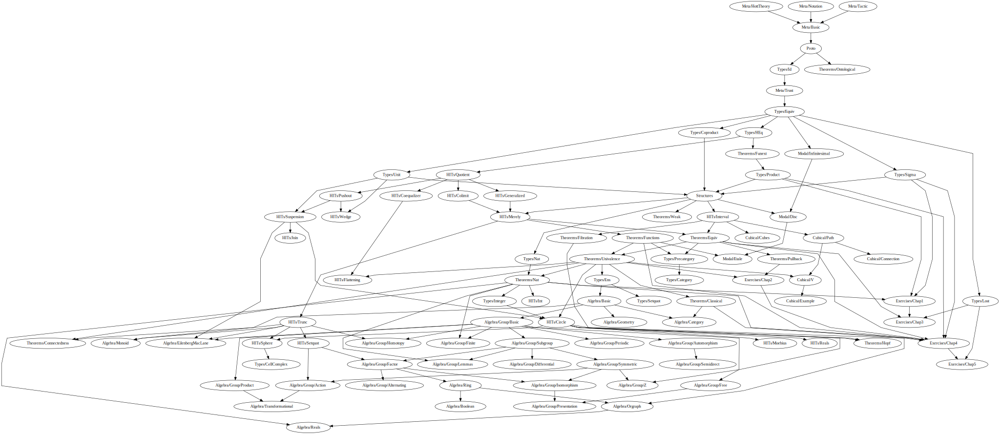

# Ground Zero

This is an attempt to develop Homotopy Type Theory in [Lean 4](https://github.com/leanprover/lean4/).

As in [gebner/hott3](https://github.com/gebner/hott3), no modifications to the Lean kernel are made, because library uses [large eliminator checker](https://github.com/forked-from-1kasper/ground_zero/blob/master/GroundZero/Meta/HottTheory.lean) ported [from Lean 3](https://github.com/gebner/hott3/blob/master/src/hott/init/meta/support.lean). So stuff like this will print an error:

```lean
hott theorem Id.UIP {α : Type u} {a b : α} (p q : a = b) : p = q :=
begin cases p; cases q; apply Id.refl end
```

## HITs

[Most HITs in the library](https://github.com/forked-from-1kasper/lean/tree/master/ground_zero/HITs) constructed using [quotients](https://leanprover.github.io/theorem_proving_in_lean/axioms_and_computation.html#quotients). Quotients in Lean have good computational properties (`Quot.ind` computes), so we can define HITs with them without any other changes in Lean’s kernel.

There are:

* [Interval](https://github.com/forked-from-1kasper/ground_zero/blob/master/GroundZero/HITs/Interval.lean) .
* [Pushout](https://github.com/forked-from-1kasper/ground_zero/blob/master/GroundZero/HITs/Pushout.lean) .
* [Homotopical reals](https://github.com/forked-from-1kasper/ground_zero/blob/master/GroundZero/HITs/Reals.lean) .
* (Sequential) [colimit](https://github.com/forked-from-1kasper/ground_zero/blob/master/GroundZero/HITs/Colimit.lean).
* [Generalized circle](https://github.com/forked-from-1kasper/ground_zero/blob/master/GroundZero/HITs/Generalized.lean) .
* [Propositional truncation](https://github.com/forked-from-1kasper/ground_zero/blob/master/GroundZero/HITs/Merely.lean) as a colimit of a following sequence:
  
* [Suspension](https://github.com/forked-from-1kasper/ground_zero/blob/master/GroundZero/HITs/Suspension.lean)  is defined as the pushout of the span .
* [Circle](https://github.com/forked-from-1kasper/ground_zero/blob/master/GroundZero/HITs/Circle.lean)  is the suspension of the bool .
* Sphere  is the suspension of the circle .
* [Join](https://github.com/forked-from-1kasper/ground_zero/blob/master/GroundZero/HITs/Join.lean) .

There are also HITs that cannot be constructed this way. These HITs are defined using standard trick with [private structures](https://github.com/forked-from-1kasper/ground_zero/blob/master/GroundZero/HITs/Trunc.lean).

## Dependency map


